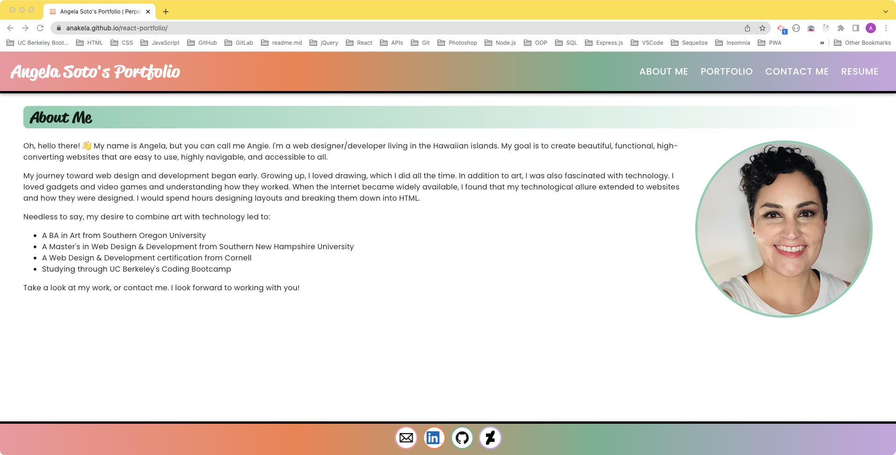
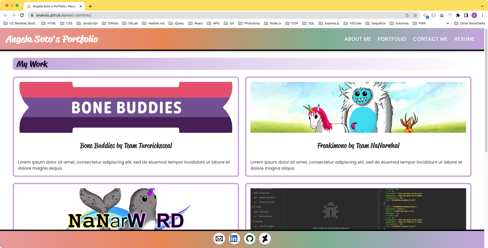
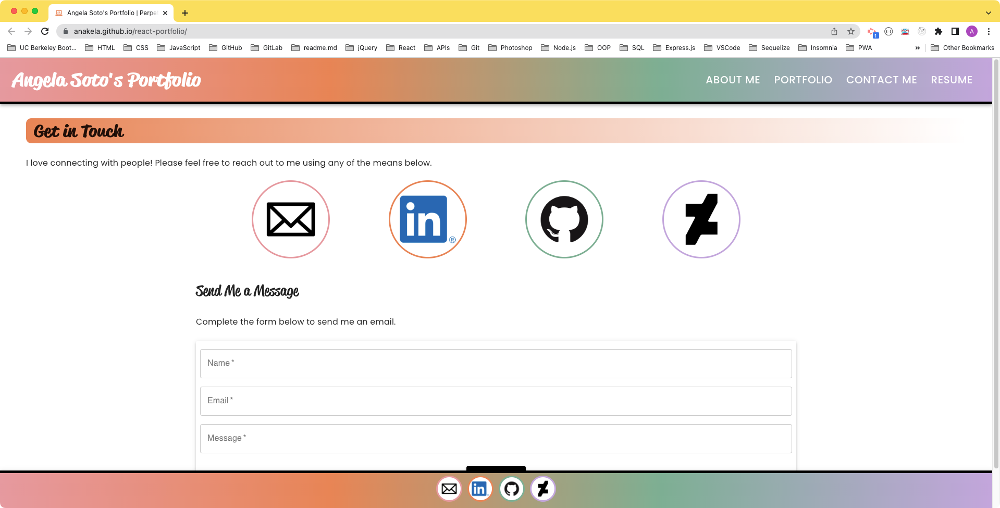
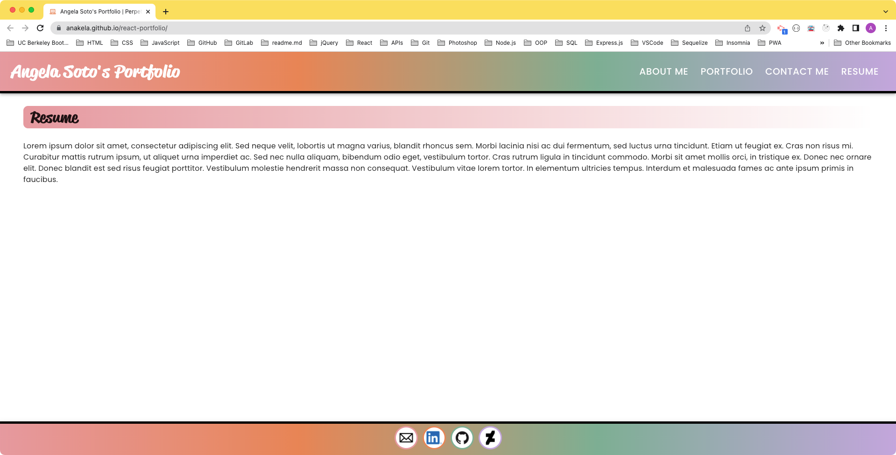
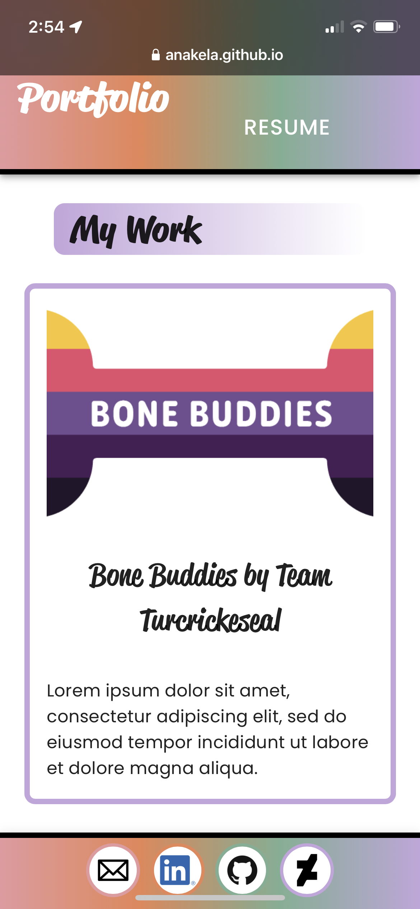
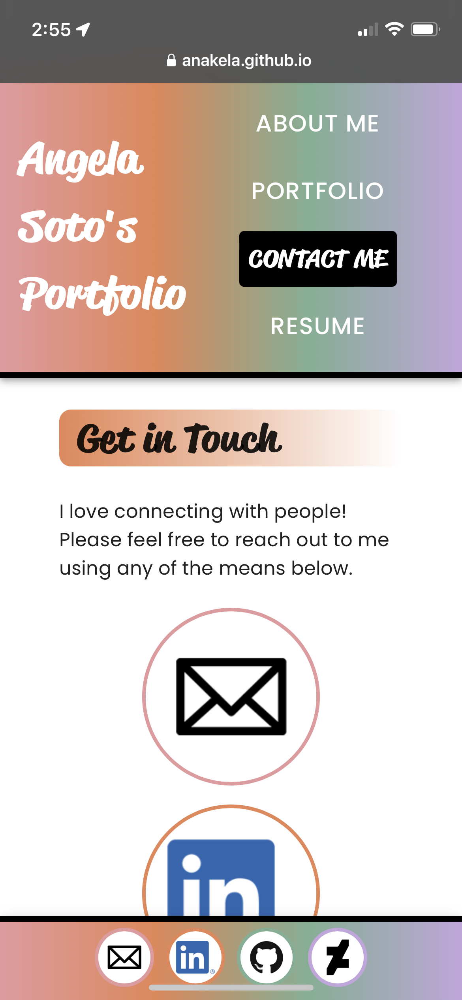
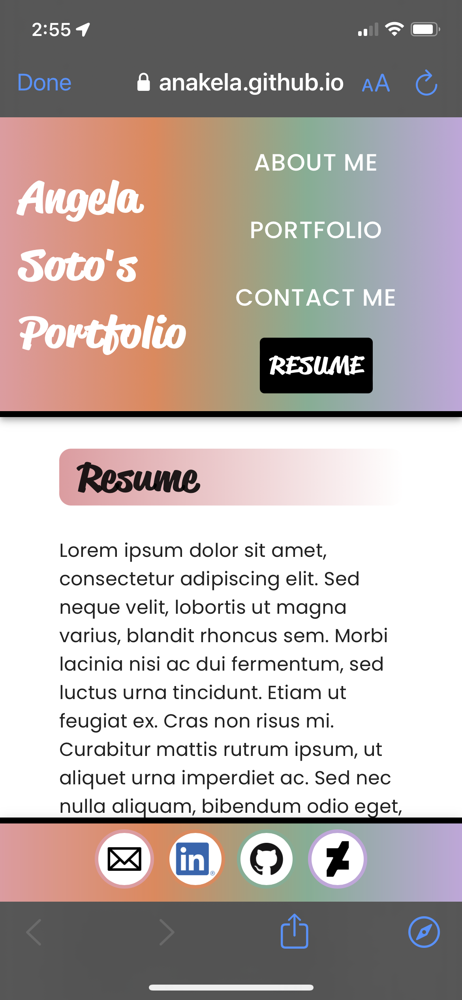

# Challenge 20: React Portfolio

## Table of Contents

- [Overview](#overview)
  - [The Challenge](#the-challenge)
  - [User Story](#user-story)
  - [Acceptance Criteria](#acceptance-criteria)
  - [Screenshot](#screenshot)
  - [Links](#links)
- [My Process](#my-process)
  - [Built With](#built-with)
  - [What I Learned](#what-i-learned)
  - [Continued Development](#continued-development)
  - [Useful Resources](#useful-resources)
- [Author](#author)
- [Acknowledgments](#acknowledgments)

## Overview

### The Challenge

>Being a web developer means being part of a community. You’ll need a place not only to share your projects while you're applying for jobs or working as a freelancer but also to share your work with other developers and collaborate on projects.
>
>Your task is to create a portfolio using your new React skills, which will help set you apart from other developers whose portfolios don’t use the latest technologies. 
>
>You’ll deploy this application to GitHub Pages. Follow the instructions in the Git Guide or consult the [Create React App Docs on GitHub Pages](https://create-react-app.dev/docs/deployment/#github-pages) to create a build that you can deploy.
>
>**Important**: Be sure to push your codebase to the default branch in GitHub -- NOT your built and deployed code. Ensure this happens by using the `gh-pages` branch to host the deployed application's build.

### User Story

```md
AS AN employer looking for candidates with experience building single-page applications
I WANT to view a potential employee's deployed React portfolio of work samples
SO THAT I can assess whether they're a good candidate for an open position
```

### Acceptance Criteria

```md
GIVEN a single-page application portfolio for a web developer
WHEN I load the portfolio
THEN I am presented with a page containing a header, a section for content, and a footer
WHEN I view the header
THEN I am presented with the developer's name and navigation with titles corresponding to different sections of the portfolio
WHEN I view the navigation titles
THEN I am presented with the titles About Me, Portfolio, Contact, and Resume, and the title corresponding to the current section is highlighted
WHEN I click on a navigation title
THEN I am presented with the corresponding section below the navigation without the page reloading and that title is highlighted
WHEN I load the portfolio the first time
THEN the About Me title and section are selected by default
WHEN I am presented with the About Me section
THEN I see a recent photo or avatar of the developer and a short bio about them
WHEN I am presented with the Portfolio section
THEN I see titled images of six of the developer’s applications with links to both the deployed applications and the corresponding GitHub repositories
WHEN I am presented with the Contact section
THEN I see a contact form with fields for a name, an email address, and a message
WHEN I move my cursor out of one of the form fields without entering text
THEN I receive a notification that this field is required
WHEN I enter text into the email address field
THEN I receive a notification if I have entered an invalid email address
WHEN I am presented with the Resume section
THEN I see a link to a downloadable resume and a list of the developer’s proficiencies
WHEN I view the footer
THEN I am presented with text or icon links to the developer’s GitHub and LinkedIn profiles, and their profile on a third platform (Stack Overflow, Twitter)
```

### Screenshot










### Links

- Solution URL: [https://github.com/anakela/react-portfolio](https://github.com/anakela/react-portfolio)
- Live Site URL: [https://anakela.github.io/react-portfolio/](https://anakela.github.io/react-portfolio/)

## My Process

### Built With

- React.js
- Node.js
- JavaScript
- CSS
- [Material UI](https://mui.com/)
- [Google Fonts](https://fonts.google.com/)
- [Adobe Fonts](https://fonts.adobe.com/)

### What I Learned

I really enjoyed bringing this portfolio to life using React.  One of the interesting things I learned during this challenge was that because this application is front-end only, I was unable to use React Router to build its navigation.  Rather, I created the navigation using `useState`.

```JavaScript
export default function PortfolioContainer() {
    const [currentPage, setCurrentPage] = useState('');

    const renderPage = () => {
        if (currentPage === 'Resume') {
            return <Resume />;
        }
        if (currentPage === 'Portfolio') {
            return <Portfolio />;
        }
        if (currentPage === 'Contact') {
            return <Contact />;
        }
        if (currentPage === 'About') {
            return <About />
        }
        return <About />;
    };
```

I also initially created a `ul` for the navigation, but updated it with buttons formatted using Material UI:

```JavaScript
export default function Navbar({ handlePageChange }) {
    return (
        <Box sx={{ flexGrow: 1, width: "100%" }} >
            <AppBar position="static" id="navbar">
                <Toolbar>
                    <Typography
                        id="nav-logo"
                        variant="h6"
                        component="div"
                        sx={{ flexGrow: 1 }}
                        fontFamily="reklame-script, sans-serif"
                        fontWeight="700"
                        fontStyle="normal"
                        fontSize="36px"
                        onClick={() => handlePageChange('About')}
                    >
                        Angela Soto's Portfolio
                    </Typography>
                    <div
                        style={{ display: "flex", direction: "row", flexWrap: "wrap", justifyContent: "space-evenly", alignContent: "center", fontWeight: "bold" }}
                    >
                        <Button
                            color="inherit"
                            onClick={() => handlePageChange('About')}
                        >
                            About Me
                        </Button>
                        <Button
                            color="inherit"
                            onClick={() => handlePageChange('Portfolio')}
                        >
                            Portfolio
                        </Button>
                        <Button
                            color="inherit"
                            onClick={() => handlePageChange('Contact')}
                        >
                            Contact Me
                        </Button>
                        <Button
                            color="inherit"
                            onClick={() => handlePageChange('Resume')}
                        >
                            Resume
                        </Button>
                    </div>
                </Toolbar>
            </AppBar>
        </Box>
    );
```

### Continued Development

Moving forward, there are several more updates I would like to make.
- First, I would like to add a back-end to my React portfolio so that I can make the Contact form work and validate correctly.
- I will also be updating the Resume page with real information once I consult with the Careers Department.
- Lastly, I would like to add more internal links so that I can better reference different pages within one another.

### Useful Resources

- [Adobe Fonts: Reklame Script](https://fonts.adobe.com/fonts/reklame-script)
- [Emojipedia](emojipedia.comemojipedia.com)
- [Google Fonts](https://fonts.google.com/specimen/Poppins?query=poppins)
- [Material UI](https://mui.com/material-ui/getting-started/overview/)
- [PluralSight: How to Render <a> with Optional href in React](https://www.pluralsight.com/guides/how-to-render-%22a%22-with-optional-href-in-react)
- [Regexr.com](https://regexr.com/)
- [StackOverflow: How to change background color in react materialUI card](https://stackoverflow.com/questions/58799624/how-to-change-background-color-in-react-materialui-card)
- [W3Schools: Linear Gradients With Transparency](https://www.w3schools.com/css/tryit.asp?filename=trycss3_gradient-linear_trans)

## Author

- GitHub - [https://github.com/anakela](https://github.com/anakela)
- LinkedIn - [https://www.linkedin.com/in/anakela/](https://www.linkedin.com/in/anakela/)

## Acknowledgments

- Bobbi Tarkany (Tutor)
- Scott Nelson (TA)
- Fellow Bootcampers:
    - Asha Chakre
    - Nolan Spence
